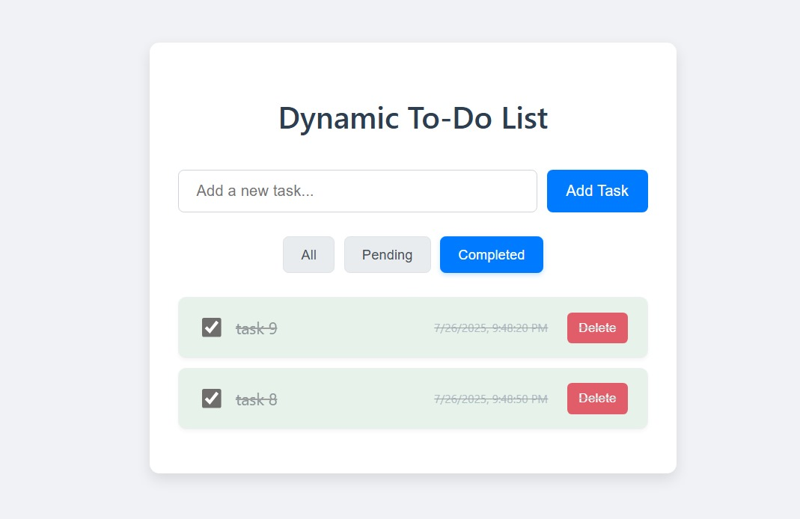

# 📝 Dynamic To-Do List Web App

A lightweight, responsive To-Do List application built with pure HTML, CSS, and JavaScript. Features local storage persistence, task filtering, and mobile-friendly design.

## 🎯 Features

### Core Functionality
✅ Add, complete, and delete tasks  
✅ Real-time local storage saving  
✅ Keyboard support (Enter to add tasks)  

### Advanced Features
⏳ Creation timestamps for each task  
🔘 Filter tasks (All/Pending/Completed)  
📱 Fully responsive design  
🎨 CSS animations for smooth interactions  

## 🛠️ Tech Stack

**Frontend:**  


**Key Concepts:**  
DOM Manipulation | Local Storage API | Responsive Design | Event Delegation

## 📸 Screenshots

| Desktop View |
| ![Desktop] |

## 🚀 Installation

1. Clone the repository:
   ```bash
   git clone https://github.com/Muqadas-g/Task-10